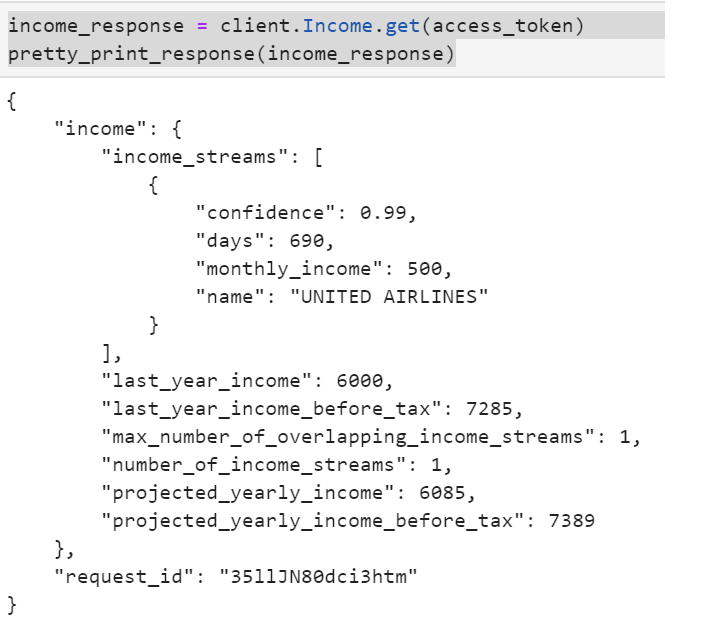

# Using APIs to Connect to Banking and Investment Accounts
## Overview
--- 
The purpose of this notebook is to simulate budgeting and financial planning services. It uses API's to connect to customer's account transactions data for budget analysis, and to fetch historical closing prices for a retirement portfolio. Using the historical data, we will run Monte Carlo simulations to project the portfolio performance over 30 years and conduct retirement analysis. By using API's, we are able to obtain the latest data and create reports that link the client's banking and investment accounts. 
## Budget Analysis with the Plaid API
In order to access data in Plaid's free developer Sandbox, we need to generate authentication tokens by using the `plaid-python api`. The firt step is to establish our credentials. For privacy and security reasons, personal keys should never be hardcoded, instead we should use environmental variables for this part of the process. 
```python 
# Establish Credentials
PLAID_CLIENT_ID = os.getenv('PLAID_CLIENT_ID')
PLAID_SBX_SECRET_KEY = os.getenv('PLAID_SBX_SECRET_KEY')
PLAID_PUBLIC_KEY = os.getenv('PLAID_PUBLIC_KEY')
PLAID_ENV = os.getenv('PLAID_ENV', 'sandbox')
PLAID_PRODUCTS = os.getenv('PLAID_PRODUCTS', 'transactions')
```
We can refer to the [Plaid API Docs](https://plaid.com/docs/) to connect and downdload transactions and account data to conduct budget analysis. The following pie chart breaks down expenses by category for the last 90 days. 


In order to provide financial services like retirement planning, we need to obtain current income data. We can streamline this process by using the Plaid API. 



## Retirement Planner
In this section we use the IEX API to fetch historical closing prices for a retirement portfolio. We can refer to the [iexfiance](https://addisonlynch.github.io/iexfinance/stable/stocks.html) documentation and use the `get_historical_data` function. Then we use pandas `pct_change, mean, and std` functions to calculate the portfolio's average daily returns and average daily volatility. Finally, we can project the retirement portfolio performance by using a nested 'for loop` to run Monte Carlo simulations 500 times for the next 30 years. 


## Retirement Analysis
In this section we use `numpy.quantile` function to estimate the expected returns at 30 years for the 10th, 50th, and 90th percentiles with a $20,000 initial investment. 


For the purpose of this analysis, we will assume a 4% withdrawal rate from the retirement portfolio and compare it to the projected annual income we obtained from  Plaid. 


